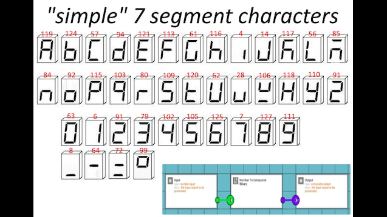

# 7-seg-clock
7-Segment NTP Clock based on the ESP32-C3

## TODO

- add ability to display errors
- add ability to change brightness (using button perchance?)
- make an actual readme
- case + build

## Display Pinout

## Alphabet

## Error Codes

- wifi: no wifi connected
- fail: OTA update failed
- sync: NTP sync failed
- eepr: eeprom read error
- mdns: mdns responder init failed