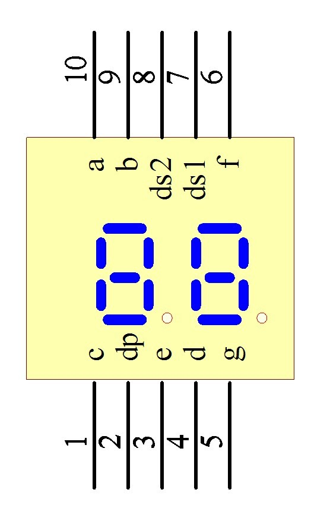

# 7-seg-clock
7-Segment NTP Clock based on the ESP32-C3

## TODO

- trigger "special update routine" to avoid tweaking out the display
- make webui not ugly
- add ability to display errors
- add ability to change brightness (using button perchance?)

## Display Pinout

